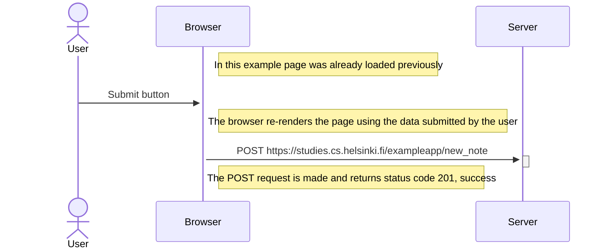

## New Note Submission Sequence Diagram
*Submitting a New Note in the Single Page App*

```mermaid
sequenceDiagram
    actor User
    participant Browser
    participant Server
    Note right of Browser: In this example page was already loaded previously
    User->>+Browser: Submit button
    Note right of Browser: The browser re-renders the page using the data submitted by the user
    Browser->>+Server: POST https://studies.cs.helsinki.fi/exampleapp/new_note
    activate Server 
    deactivate Server
    Note right of Browser: The POST request is made and returns status code 201, success
```
##