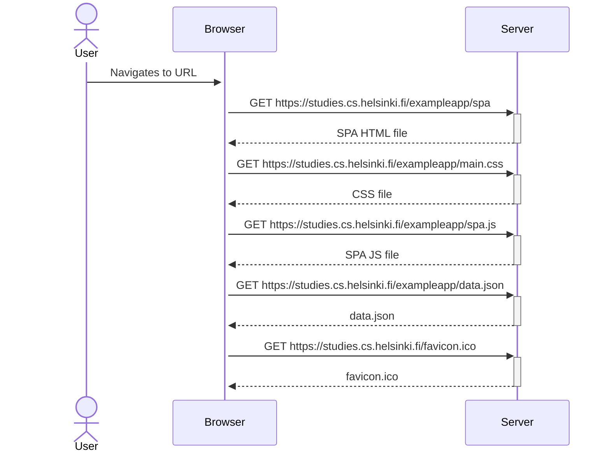

## New Note Submission Sequence Diagram
*Loading the Single Page App*

```mermaid
sequenceDiagram
    actor User
    participant Browser
    participant Server
    
    User->>+Browser: Navigates to URL
    
    Browser->>+Server: GET https://studies.cs.helsinki.fi/exampleapp/spa
    Server-->>-Browser: SPA HTML file

    Browser->>+Server: GET https://studies.cs.helsinki.fi/exampleapp/main.css
    Server-->>-Browser: CSS file 
    
    Browser->>+Server: GET https://studies.cs.helsinki.fi/exampleapp/spa.js
    Server-->>-Browser: SPA JS file
    
    Browser->>+Server: GET https://studies.cs.helsinki.fi/exampleapp/data.json
    Server-->>-Browser: data.json
    
    Browser->>+Server: GET https://studies.cs.helsinki.fi/favicon.ico
    Server-->>-Browser: favicon.ico  
```
##