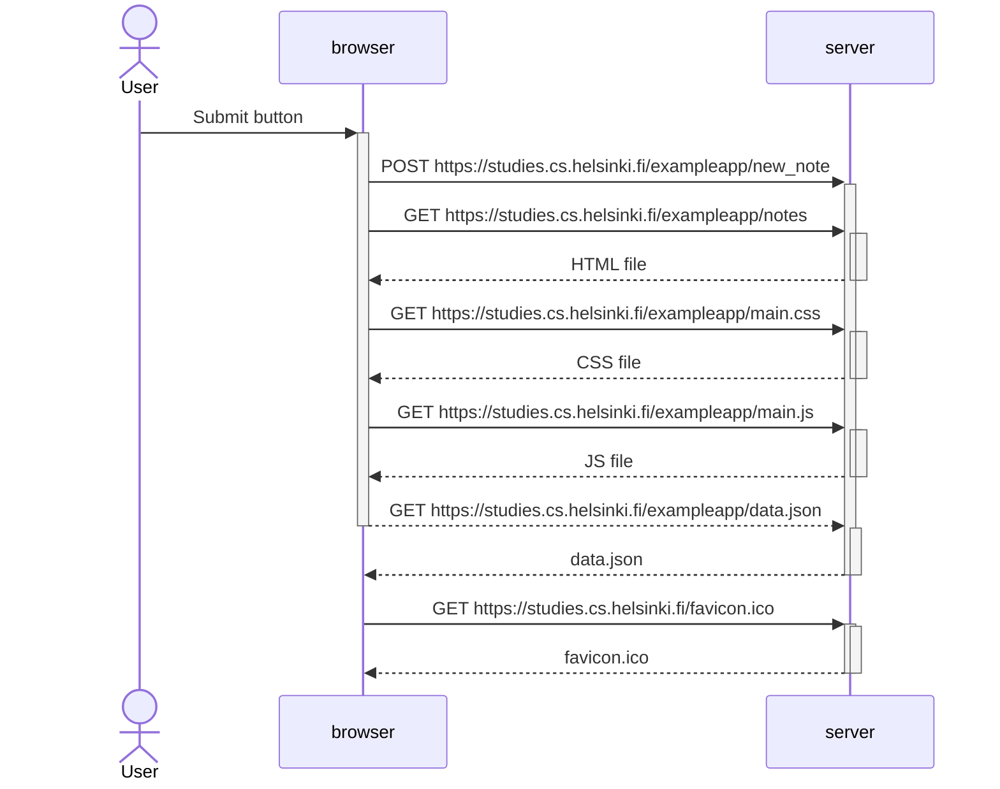

## New Note Submission Sequence Diagram
*Submitting a New Note*

```mermaid
sequenceDiagram
    actor User
    participant browser
    participant server

    User->>+browser: Submit button
    
    browser->>+server: POST https://studies.cs.helsinki.fi/exampleapp/new_note

    browser->>+server: GET https://studies.cs.helsinki.fi/exampleapp/notes
    activate server
    server-->>-browser: HTML file
    deactivate server
    
    browser->>+server: GET https://studies.cs.helsinki.fi/exampleapp/main.css
    activate server
    server-->>-browser: CSS file
    deactivate server 
    
    browser->>+server: GET https://studies.cs.helsinki.fi/exampleapp/main.js
    activate server
    server-->>-browser: JS file
    deactivate server
    
    browser-->>-server: GET https://studies.cs.helsinki.fi/exampleapp/data.json
    activate server
    server-->>-browser: data.json
    deactivate server
    
    browser->>+server: GET https://studies.cs.helsinki.fi/favicon.ico
    activate server
    server-->>-browser: favicon.ico
    deactivate server
```
##